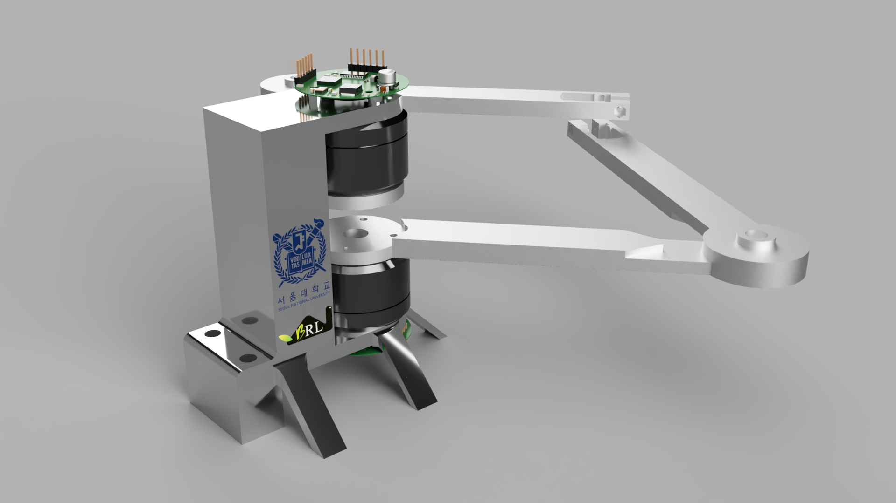

# BLDC Driver and Application

  This is my final project in the master course named "Actuation and Sensing Mechanisms for Robots". The BLDC (Brushless DC Electric Motor) is a famous motor that is used in several research fields. In the seminars and presentations, many different types of robots are introduced including the MIT Cheetah, SEA Module (Series Elastic Actuator), RHex, Sprawl, and so on. 

  In this course, we need to do the final project which is determined by ourselves.  The main reason for us to choose the BLDC is that the robot is usually driven by a motor and I want to get in touch with the driving, sensing, and controlling of this motor. In this project, I designed and assembled the PCB for motor driving and sensing, and programmed the control algorithm with the FOC (Field Orientated Control). Thus, after this project, I am familiar with the motor driver, magnetic sensor, i2c protocol, and FOC algorithm.

## 1. Hardware

  The main hardware design files are included in this folder. If you want to fabricate it, you could just upload the Gerb file to the fabricator.

## 2. Firmware

  I used `STM32CubeIDE` as the main tool to program. Thus I recommend you who are interested in this firmware download and install it to view my project.

## 3. Software

  I use one of the SVG libraries to transport the SVG file into a mount of points to draw.

